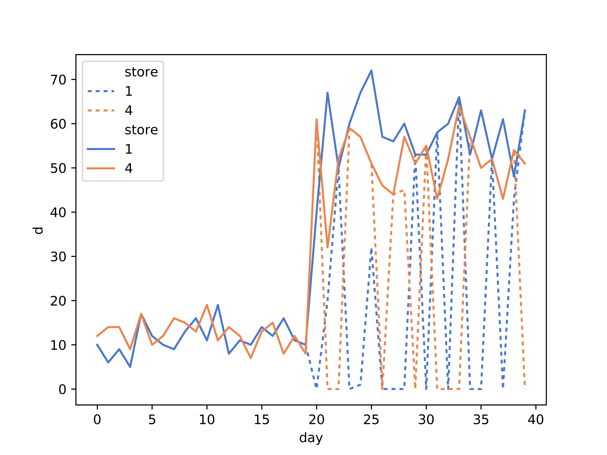

# linear QP code
### Solving a Quadratic Problem (QP) in an open source linear solver (python-mip)
qp-mip-example

## installation 
    cd qp-mip
    pip install .

## usage
both models in the example are in `model.py` module, the helper described in the article is in `helpers.mip`. The result plots are in the `result\` folder. 

some of the equations latex code used in the article are in the `model.tex` file 

## model 

results linear version

results quadratic version
